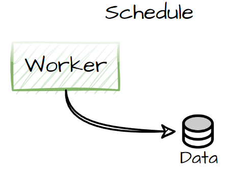
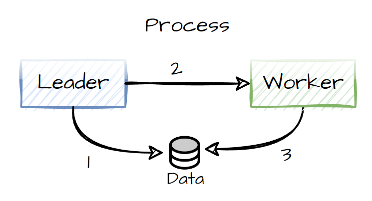
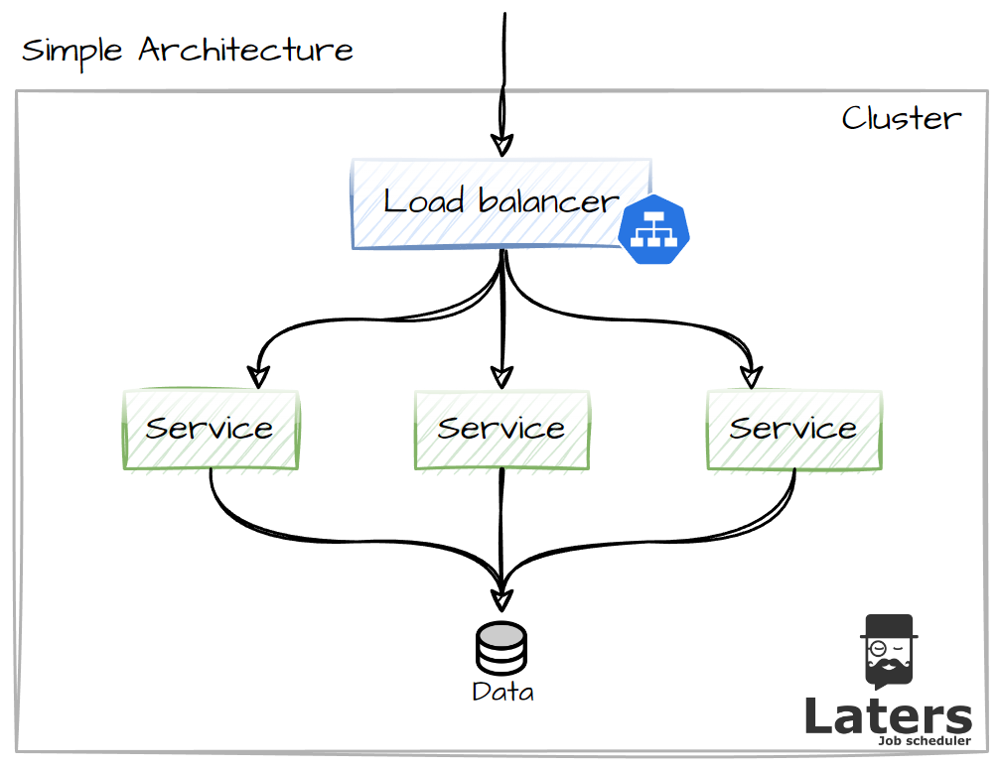
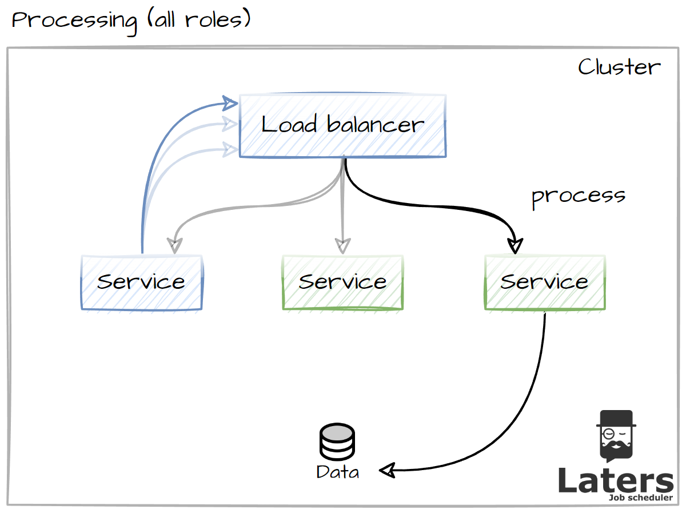
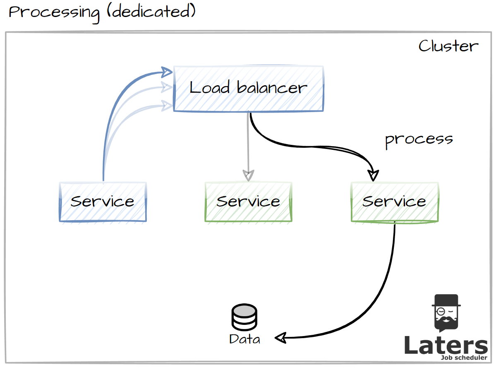

# Archiecture Overview.

## Concepts.

`Laters` is split into 2 main flows (+ a couple of others, which we will cover)

### Schedule.

While your application processes logic it will queue Jobs to be processed for later. this can be in the form of a fire-and-forget or a CRON, these are ways to queue work to be processed.

All scheduled work is stored in a data store, to allow it to be processed by different instances of the same application.

### Process.

Processes in which a Leader will scan the Datastore to jobs to be processed, and send them to the workers to process, the workers update the job accordingly.

## Target Architectures.

> [!NOTE]
> you can run this with a `single instance` and no load balancer (by targeting localhost)

Although `Laters` is a .NET package, it takes `advantage` of a common architecture style, with many services behind a `load balancer` (Service in Kubernetes).

so we can apply `Laters` in a few different ways

- all services can be all roles
- dedicated leaders and workers

### All Roles.

> [!NOTE]
> Any node can be elected leader

This solution is designed to be simpler, where one instance will be elected leader, and all instances are workers

- blue - Leader
- green - Worker

### Dedicated Roles.

> [!NOTE]
> The leader does not process jobs (at all)

This solutions is designed for niche situations (massive performance), where one instance is designated as the leader (cordoned off from the load balancer), and the worker only concentrate on processing

- blue - Leader
- green - Worker