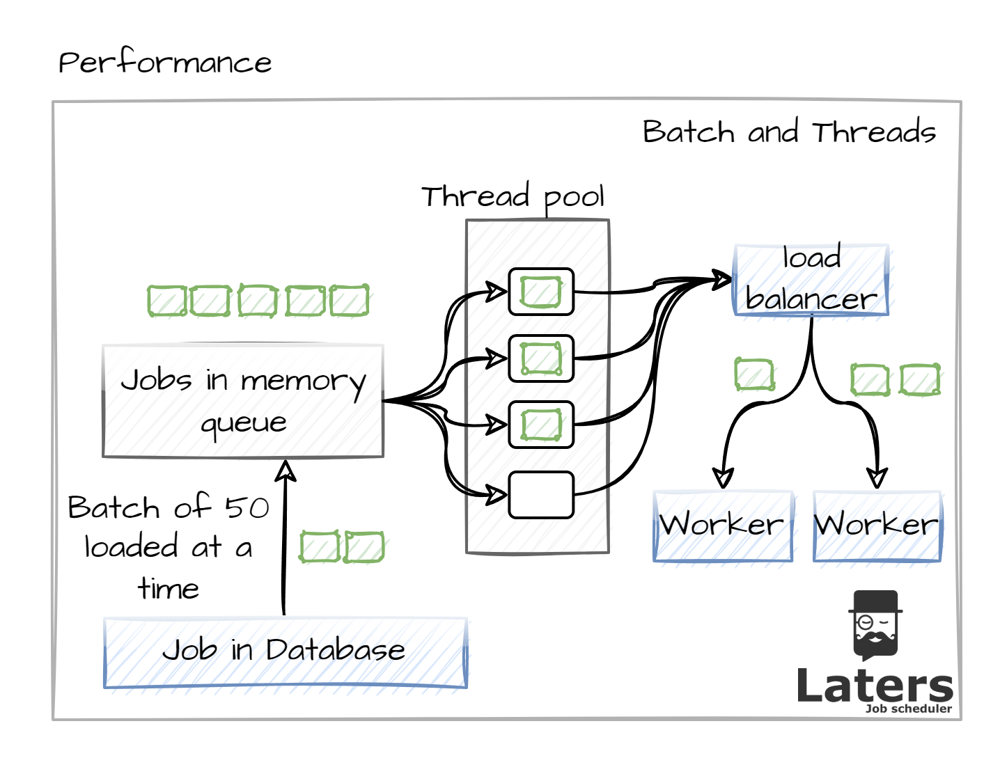
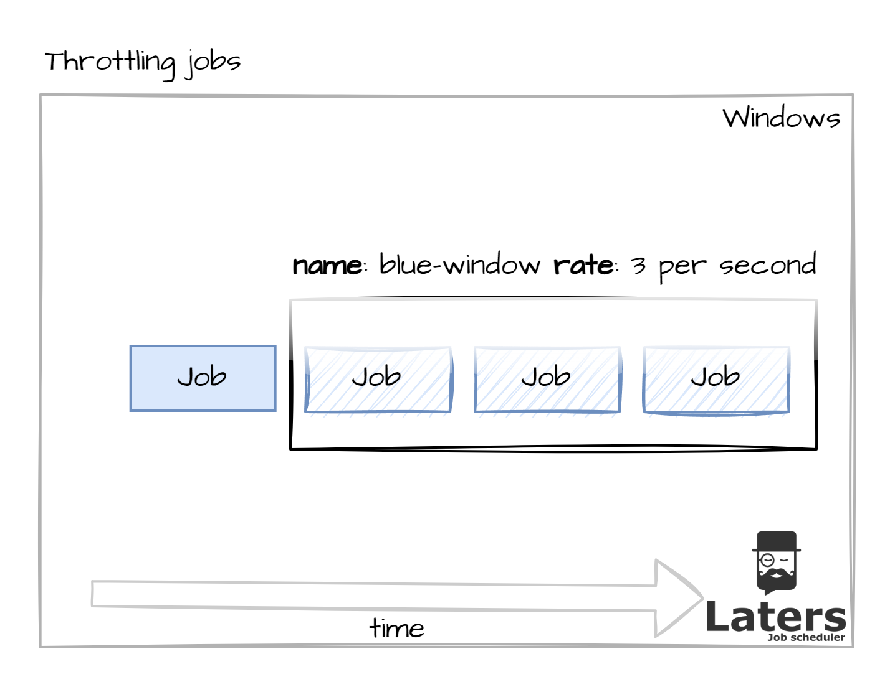
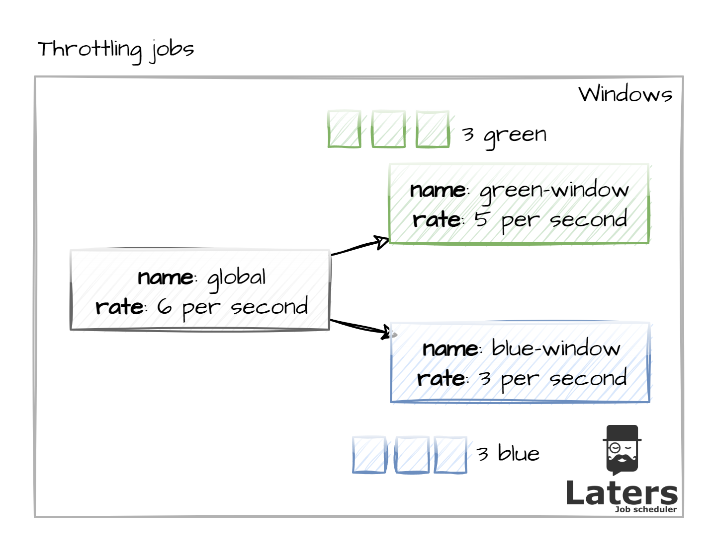
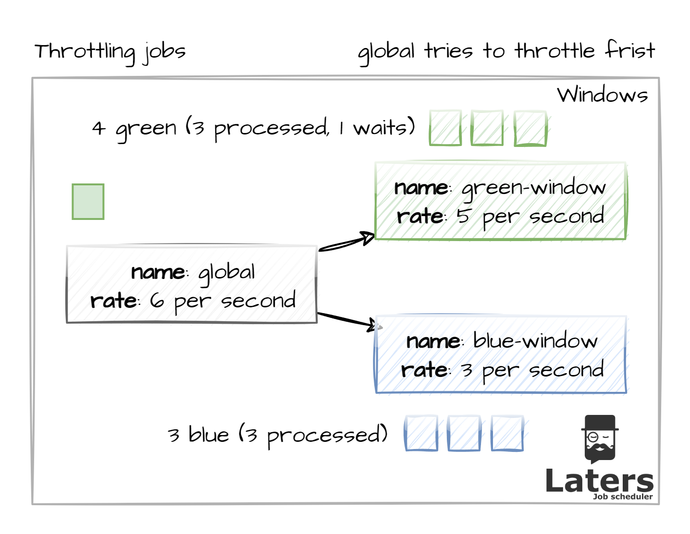
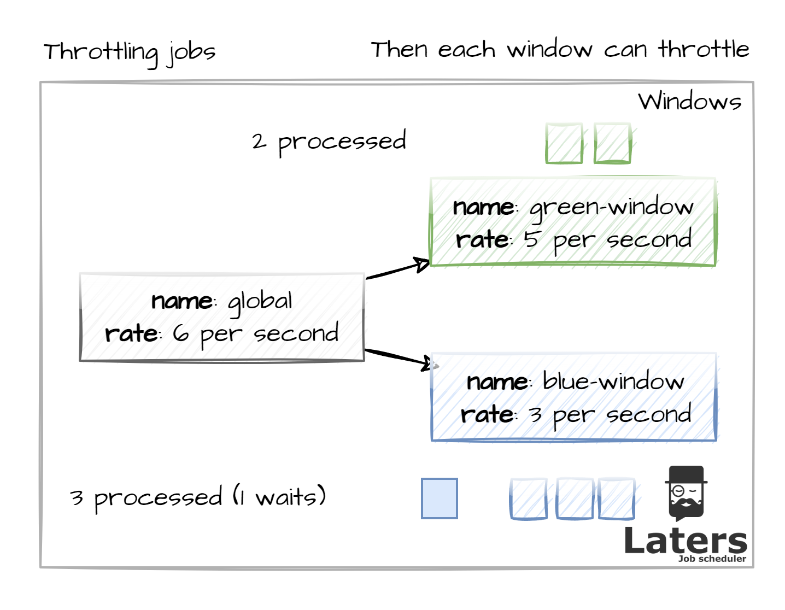

# Performance

> [!NOTE]
> The architecture makes use of your loadbalancer, however here are a few more controls avalible to you 

While dealing with scheduled tasks, you may need to apply controls to

- increase throughput
- control how many jobs are being processed in a timeframe
 
while these seem to be in contradiction (maximising and limiting) both are under the hood of performance

## Parallel Processing

> [!NOTE]
> please note the defaults are: `InMemoryWorkerQueueMax` 45 and `NumberOfProcessingThreads` 10

While the leader loads queued jobs to be processed, you can control 

- The number of Jobs to batch
- The number of Jobs to process in parallel

Configure both of these togeher in order to tune the performance to your needs.

howe this works is

the batch, will load into memory all the jobs to process (only the IDs)

The `In Memory Queue`, reduces the commincation with the database.

The `Thread Pool`, increased the number of concurrency in processed jobs (taking advantage of the threading in .NET).

## Rate limiting

> [!NOTE]
> `gobal` is set to `1_000_000` in a `1` second window , it is **recommened** to override this.

This is a mechanism where we use Tumberling winows to limit the number of Jobs that can be processed within a given time frame.

An example of this is when you application has extreme high through put which adds jobs to be processed, which can wait a while. This will allow you to throttle the processing and minimise the amount of hardware you may require (without a rate-limiter you could cause massive drain on your hardware or on downstream services)

The leader will hold details of how many Jobs have been processed and in which windows.

### Types of window

there are 2 types of window

- `global` - set this to set the TOTAL number of message that can be processed in a given window
- `named windows` - you can provide named tumbling windows to provide sub limits for certain jobs.

If a job is queued without a named-window, then only the global window is applied.

In this case you can see all jobs are rate-limited 

- via global fist
- then 3 are processed by the green-window and 3 by the blue-window

If we process more items in the time frame, for the global, any items will wait till the window count goes back down.

Limiting is finally applied at a named window, for Jobs which are associated with that window, in this case the 4th blue item will be processed when the window clears down.