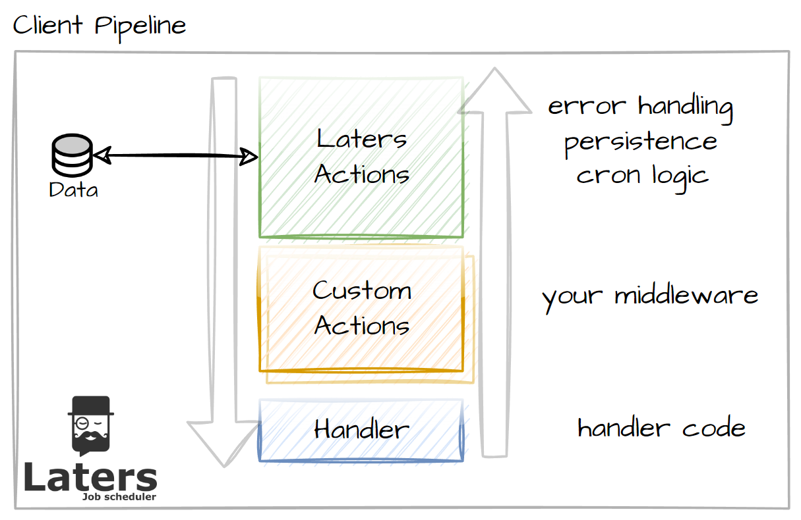

# Client Pipeline

> [!IMPORTANT]
> Performance is faster on 2nd execution and onwards. See [Performance](./client-pipeline#performance)

When processing a job, we run the job through `middleware` which you can extend.

This allows us to apply several actions before and after the Handler executes, which means you can add custom logic as you see fit (i.e. `caching`, `validation` etc)

## pipeline overview

The pipeline looks like this:

we have the following 3 areas

- `Laters Actions` - this is where we apply the logic that processes the current job.
- `Custom Actions` - any actions your application would apply.
- `Handler` - the particular logic to be applied against the single job type.

This pipeline is very similar to the ones that you will find in MVC, MassTransit etc.

## Performance

On the first run for each Job Type, a pipeline is compiled, which means 1st run will be slower, and all following sections will run faster.

The is done this way to allow each Job Type to have unique actions if required.