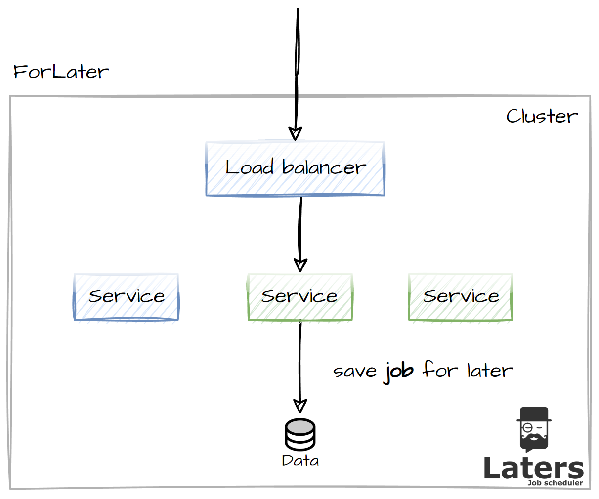
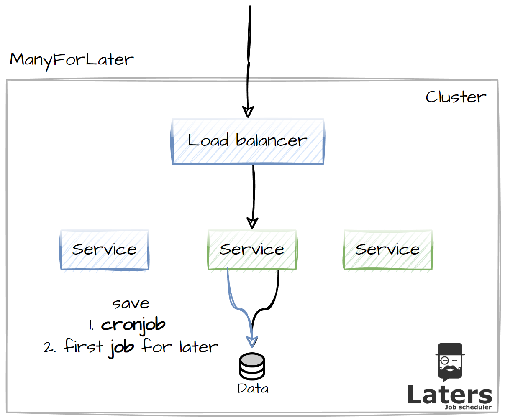

# Queueing / Scheduling

> [!NOTE]
> All jobs are delivered once or more, ensure you design/code for this.

> [!NOTE]
> All jobs are enqueued inside the unit of work.

This is the act of queueing work to be executed Later (get it 😁).

there are 2 models of scheduling jobs

- Fire-and-forget
- Cron

## Fire and forget

Where we need to enqueue a single job directly, for single process.

A job can be scheduled for processing asap or delayed for a dsired datetime.

## Cron

Where we need to process a job on a Cron, i.e. once a week or every night

A Cron can be setup on the fly or setup at start up (the latter is classified as a global Cron)

> [!NOTE]
> note that when the cron is enqueue, the first job (instance of the cron) is created and enqueued.