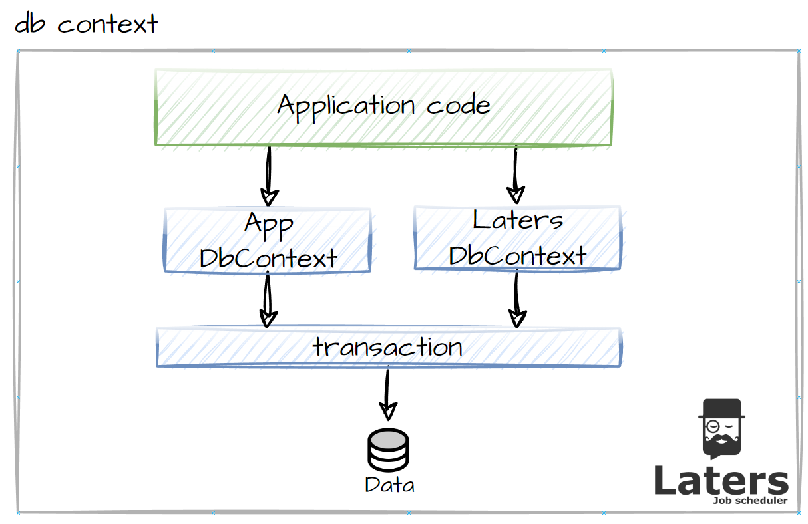

# EntityFrameworkCore.

`Postgres`, `SqlServer`, `Sqlite` are supported with `EntityFrameworkCore`, we have written a provider to make it work with `Laters` (and applied minimal testing with `Postgres`)


## Overview.

`Laters` supplies its own `DbContext`, and this is designed to work with your applications `DbContext`

It does this via sharing the same `Connection` and `Transaction`



This allows us to achieve an all-or-nothing apply/commit to the database.

## Configuration.

> [!NOTE]
> This configuration will show how do to this with `Postgres`, however, you can apply almost the same code to `SqlServer` or `Sqlite`.

### Nuget

You can add this support via Nuget

```sh
dotnet add package Laters.Data.EntityFrameworkCore
```

### Services - Connection

The connection is to be shared with your `DbContext` and `Laters`

```csharp
//this is the connection we will share between the contexts
builder.Services.AddScoped(provider =>
{
    var connectionString = "host=postgres;database=laters;password=ABC123!!;username=application";
    var connection = new Npgsql.NpgsqlConnection(connectionString);
    return (DbConnection)connection;
});
```

You can use the `IDbConnectionFactory` if you want.

### Services - App DbContext

When adding your `DbContext`, remember to inject the `DbConnection` into the `UseXXX` 

```csharp
//the todo context
builder.Services.AddDbContext<TodoItemDbContext>((provider, options) =>
{
    var connection = provider.GetRequiredService<DbConnection>();
    options.UseNpgsql(connection);
});
```

### HostBuilder - Laters

- 1️⃣ - pass in `UseEntityFramework` to the `UseStorage` method, and this will set up the storage
- 2️⃣ - Setup the `DbConnection` to use, you can see it's the same connection as before.
- 3️⃣ - Setup the  `Options` for the `LatersDbContext`, and inject the `connection`.

```csharp

builder.WebHost.ConfigureLaters((context, setup) =>
{
    //configure Laters
    //...

    // 1️⃣
    setup.UseStorage<UseEntityFramework>(ef => {
        
        // 2️⃣
        ef.ConnectionFactory = provider => provider.GetRequiredService<DbConnection>();

        // 3️⃣setup the laters dbcontext
        ef.ApplyOptions = (_, connection, options) =>
        {
            options.UseNpgsql(connection, b => b.MigrationsAssembly("EpicTodoList"));
        };
    });
});
```

## DbContext

create your application's `DbContext`

- 1️⃣ - supply a `constructor` which takes in a typed `DbContextOptions`.

```csharp
public class TodoItemDbContext : DbContext
{

    // 1️⃣
    public TodoItemDbContext(DbContextOptions<TodoItemDbContext> options) : base(options)
    {        
    }

    public DbSet<TodoItem> TodoItems { get; set; } = null!;
}
```

## ASP.NET

### Middleware 

This **depends** on how you want to manage the commit across the `DbContexts`

The following is using middleware to synchronize the transaction across the 2 `DbContexts` at the end of any HTTP Request.


```csharp
public class TransactionMiddleware
{
    readonly RequestDelegate _next;
    
    public TransactionMiddleware(
        RequestDelegate next)
    {
        _next = next;
    }

    public async Task InvokeAsync(
        HttpContext context, 
        LatersDbContext latersDbContext, 
        TodoItemDbContext todoDbContext, 
        DbConnection connection)
    {
        await _next(context);

        if(connection.State != ConnectionState.Open)
            connection.Open();

        using var tx = connection.BeginTransaction(IsolationLevel.Serializable);

        latersDbContext.Database.UseTransaction(tx);
        todoDbContext.Database.UseTransaction(tx);

        latersDbContext.SaveChanges();
        todoDbContext.SaveChanges();

        tx.Commit();
    }
}
```

### Register

Add `UseLaters` to apply all the `Laters` middleware, and the `TransactionMiddleware` so we can handle the transaction correctly.

```csharp
app.UseLaters();
app.UseMiddleware<TransactionMiddleware>();
```

## Migrations

as you are running 2 contexts, you will need to create the migration for both.

### Application

The following will create the migration for you application's code

```sh
dotnet ef migrations add InitialCreate -p EpicTodoList --context TodoItemDbContext
```

Apply the update to your database.

```sh
dotnet ef database update -p EpicTodoList --context TodoItemDbContext
```

### Laters

> [!NOTE]
> The migrations for laters needs to be setup in the `UseEntityFramework`, shown above

The following will create the migration `Laters` `DbContext`

```sh
dotnet ef migrations add InitialCreate -p Laters.Data.EntityFramework --context LatersDbContext
```

Apply the update to your database.

```sh
dotnet ef database update -p EpicTodoList --context LatersDbContext
```
