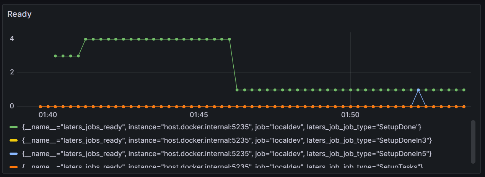

# Open Telemetry

> [!NOTE]
> all traces, metrics and logs include labels for extra meta-data

Telemetry is fully supported to help debug what is going on

## Metrics 

> [!NOTE]
> In preview

Metrics are there to help develop dashbaords, and you can use them to see what is going on inside `laters`



There are a few metrics collected inside the `laters` library

| metric                     | type        | Use                                               |
| -------------------------- | ----------- | ------------------------------------------------- |
| laters.jobs.enqueue        | `counter`   | when a job is enqueued                            |
| laters.jobs.process        | `counter`   | when a job is processed                           |
| laters.jobs.process.errors | `counter`   | when a job is processed with errors               |
| laters.jobs.ready          | `gauge`     | number of jobs that are ready to be processed     |
| laters.jobs.scheduled      | `gauge`     | number of jobs that are scheduled to be processed |
| laters.jobs.deadletter     | `gauge`     | number of jobs that are deadlettered              |
| laters.process_time        | `histogram` | time to process the message                       |

### Code

Collect Metrics using the OpenTelemetry library, and export them via Prometheus

- 1️⃣ - Add OpenTelemetry to your services
- 2️⃣ - Add `laters` metrics
- 3️⃣ - Add other metrics

```csharp

var serviceName = "todoApp"; //name of your service

builder.Services.AddOpenTelemetry() // 1️⃣
    .WithMetrics(b =>
    {
        b.ConfigureResource(r => r.AddService(serviceName))
            .AddLatersInstrumentation() // 2️⃣
            
            // 3️⃣
            .AddProcessInstrumentation()
            .AddAspNetCoreInstrumentation()

            .AddPrometheusExporter();
    })
```

## Traces

As jobs are linked with other actions and other jobs, traces are supported to visualize this.


### context

When a job is enqueued/created and when it is eventually processed, you will see the trace for both these actions

| action   | span.kind  | Use                     |
| -------- | ---------- | ----------------------- |
| ForLater | `producer` | when a job is enqueued  |
| Handler  | `consumer` | when a job is processed |

here is an example of the consumer (a job being processed)


### Code

This example uses  OpenTelemtry Tracing along with its associated exporter.

- 1️⃣ - Add OpenTelemetry to your services
- 2️⃣ - Add `laters` tracing
- 3️⃣ - Add other tracing

```csharp

var serviceName = "todoApp"; //name of your service

builder.Services.AddOpenTelemetry() // 1️⃣
    .WithTracing(b =>
    {
        b.ConfigureResource(r => r.AddService(serviceName))

            .AddLatersInstrumentation() // 2️⃣
            
            // 3️⃣
            .AddAspNetCoreInstrumentation() 
            .AddNpgsql()
            .AddHttpClientInstrumentation()
            
            .AddOtlpExporter(opts =>
            {
                opts.Endpoint = new Uri("http://otel-collector:4317");
            });
    });
```


## Logs

For detailed output of information, `laters` supports logging (with no Personal Information being captured by the core library)


> [!NOTE]
> logs and traces share trace-id so you can correlate them.

### Code

The example shows how to setup logging using the Serilog library, along with exporting the logs via OpenTelemetry

- 1️⃣ - Add Serilog
- 2️⃣ - Optionally export logs to the console (stdout)

```csharp
var serviceName = "todoApp"; //name of your service

// 1️⃣
builder.Host.UseSerilog((context, config) =>
{
    config
        .Enrich.FromLogContext()
        .Enrich.With(new PropertyEnricher("service_name", serviceName))
        //.Filter.ByIncludingOnly(Matching.FromSource("Laters"))
        .WriteTo.OpenTelemetry(opt =>
        {
            opt.Endpoint = "http://otel-collector:4317";

            opt.IncludedData = IncludedData.SpanIdField |
                                IncludedData.TraceIdField |
                                IncludedData.TemplateBody;
        })
        .WriteTo.Console() // 2️⃣
        .MinimumLevel.Information();
});
```