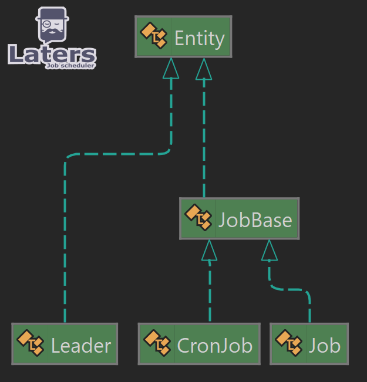

# Model

> [!NOTE]
> we store all of these types into the datastore.

Laters has 3 main types it uses in order to do its work

- `Job` - This is an instance of a single job, which has been queued to be processed
- `CronJob` - this is a re-occurring job, which contains how often to create a new Job instance based on a CRON
- `Leader` - there is only one entry for leader, and it represents the node that is acting as leader (won the leader election)